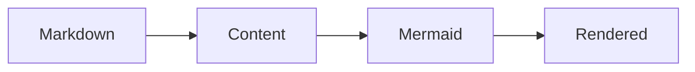

# Getting Started

Nuxt Content Mermaid is a Nuxt module. Your application owns Nuxt and Nuxt Content; this module owns the Markdown-to-diagram integration and Mermaid dependency.

## Check the prerequisites

Use Node.js `>=22.19.0`, Nuxt `^4.1.0`, and Nuxt Content `>=3.5.0 <4.0.0`.

## Install the application dependencies

Install the module and the Nuxt Content peer dependency with your package manager. Mermaid is installed by this module, so do not add it separately for this integration.

```bash
# pnpm
pnpm add @barzhsieh/nuxt-content-mermaid @nuxt/content

# npm
npm install @barzhsieh/nuxt-content-mermaid @nuxt/content

# yarn
yarn add @barzhsieh/nuxt-content-mermaid @nuxt/content
```

Nuxt Content may require a database connector in a Node application. `better-sqlite3`, `sqlite3`, and native SQLite in supported Node versions are common choices, but that choice belongs to your application and Nuxt Content—not to this module. Follow the [Nuxt Content installation guide](https://content.nuxt.com/docs/getting-started/installation) for the connectors supported by your installed version.

With pnpm v10 or later, native connector build scripts need explicit approval:

```bash
pnpm approve-builds
```

Or allow only the connector you selected in `package.json` (replace the example if needed):

```json
{
  "pnpm": {
    "onlyBuiltDependencies": ["better-sqlite3"]
  }
}
```

## Enable the module

Add Nuxt Content Mermaid to `nuxt.config.ts`:

```ts
export default defineNuxtConfig({
  modules: ['@barzhsieh/nuxt-content-mermaid'],
})
```

The module declares its Nuxt Content relationship and starts it in the required order. It does not install, pin, or update Nuxt Content; those remain application responsibilities. If your app already lists `@nuxt/content` in `modules`, keeping that entry is supported.

## Render your first diagram

Create a Markdown page in your Content source and add a `mermaid` fence:

````md
# Hello diagram


````

During the Content build, the module transforms the fence into a diagram component. The original source remains available as its readable no-JavaScript fallback.

Start Nuxt and open the route for the Markdown page:

```bash
pnpm dev
```

## Continue from here

- Author local metadata in [Writing Diagrams](/writing-diagrams).
- Set project defaults in [Configuration](/configuration).
- Adjust appearance in [Themes and Styling](/advanced/themes-and-styling).
- Diagnose a failure with [Troubleshooting](/troubleshooting).
