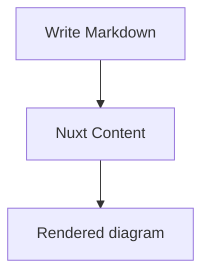
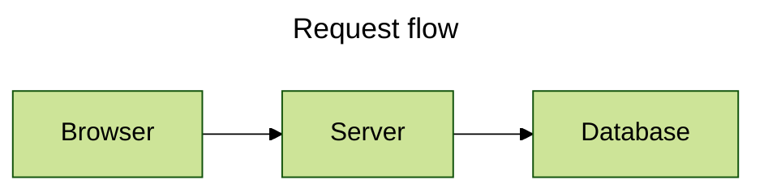
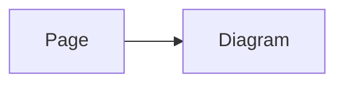
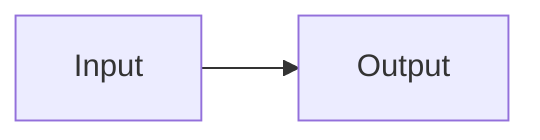

# Writing Diagrams

Use Markdown for Content-authored diagrams and the global `<Mermaid>` component for diagrams created in Vue. These paths deliberately use different configuration sources.

## Start with a Mermaid fence

Use `mermaid` as the fenced-code language:

````md

````

Only a valid, non-empty top-level Mermaid fence is transformed. Other Markdown stays unchanged, and an unclosed or invalid metadata block stays as source rather than becoming a partially configured diagram.

## Add inline attributes

Fence attributes are concise for a title, display mode, Mermaid config, or toolbar options. The supported top-level attributes are `title`, `displayMode`, `config`, and `toolbar`; nested keys use dots.

````md
```mermaid {title="Request flow" displayMode=compact config='{"theme":"forest"}' toolbar.title="Flow" toolbar.buttons.copy=false}
flowchart LR
  Browser --> Server --> Database
```
````

`config` is Mermaid-owned data. `toolbar` is package-owned and accepts `title`, `fontSize`, `fullscreenToolbarScale`, and `buttons.copy`, `buttons.fullscreen`, and `buttons.expand`.

## Use Mermaid YAML frontmatter

For several values, put Mermaid YAML frontmatter at the beginning of the diagram source. Comments and Mermaid directives may appear before it.

````md

````

The YAML `config` payload remains Mermaid-owned. The optional `toolbar` payload is handled by this module. For Mermaid's complete YAML-frontmatter schema, use the [Mermaid configuration documentation](https://mermaid.js.org/config/configuration.html).

## Configure every diagram on a page

Page Mermaid Config is the pure-data `config` field in a Content page's frontmatter. It is passed to every built-in Mermaid renderer on that page. Declare the field in your collection schema so Nuxt Content retains it:

```ts
import { defineCollection, defineContentConfig, z } from '@nuxt/content'

export default defineContentConfig({
  collections: {
    content: defineCollection({
      type: 'page',
      source: '**',
      schema: z.object({
        config: z.record(z.unknown()).optional(),
      }).passthrough(),
    }),
  },
})
```

````md
---
config:
  flowchart:
    curve: basis
---


````

Page Mermaid Config crosses the Content transport, so it must contain strict pure data. Use [Direct Mermaid Config](#use-the-component-in-vue) when application code needs a client-only Mermaid capability.

## Use Mermaid directives deliberately

Mermaid directives remain part of Mermaid source and are interpreted by Mermaid itself:

````md

````

The package does not parse a directive into its own option model. Refer to Mermaid's [directives documentation](https://mermaid.js.org/config/directives.html) for directive syntax and Mermaid-owned precedence.

## Understand which setting wins

There are two separate decisions:

1. Within fence metadata, inline attributes override Mermaid YAML frontmatter property by property. Their `toolbar` values also take precedence for the wrapper.
2. The built-in renderer combines its runtime Mermaid configuration with exactly one optional source: Page Mermaid Config for Markdown, or Direct Mermaid Config for Vue. They are not competing layers.

Theme selection is separate: a Page Mermaid Config `theme` wins over manual theme mode, detected color mode, and the base theme. Mermaid YAML frontmatter and directives are still processed by Mermaid when it reads the source. See [Themes and Styling](/advanced/themes-and-styling#understand-theme-resolution) for the package-owned policy.

## Use the component in Vue

`<Mermaid>` is globally registered. Pass URI-encoded source through `code` when source comes from application code:

```vue
<script setup lang="ts">
const source = encodeURIComponent(`flowchart TD
  A --> B`)
</script>

<template>
  <Mermaid :code="source" />
</template>
```

For a Direct Mermaid Config, pass `config` directly. Unlike Page Mermaid Config, it may include the Mermaid capabilities accepted in client-side application code:

```vue
<Mermaid :code="source" :config="{ flowchart: { curve: 'basis' } }" />
```

`pageConfig` and `config` are mutually exclusive. Supplying both is a `MermaidComponentConfigurationError`; remove one rather than using one as an override for the other. You may also omit `code` and provide a default `<pre><code>` slot, which the built-in renderer uses as source and no-JavaScript fallback.
