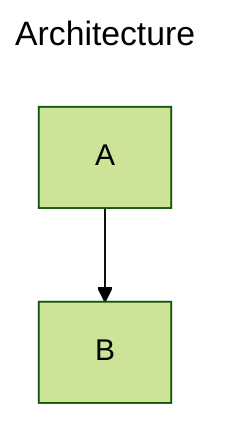
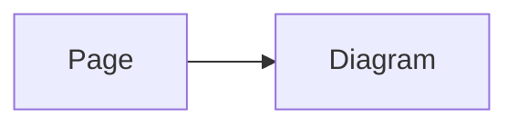

# Writing Diagrams

## Mermaid fences

Use a fenced code block whose language is exactly `mermaid`:

````md

````

Nuxt Content Mermaid replaces the source block with its Mermaid component while preserving readable source as the no-JavaScript fallback.

## Fence title and display mode

Add a title or Mermaid display mode as inline fence metadata:

````md

````

You can also place Mermaid YAML frontmatter inside a block when the diagram needs multiple values:

````md

````

## The Mermaid component

Use the globally registered `<Mermaid>` component when the diagram source comes from Vue rather than Markdown. Pass URI-encoded source through `code`:

```vue
<script setup lang="ts">
const source = encodeURIComponent(`flowchart TD
  A --> B`)
</script>

<template>
  <Mermaid :code="source" />
</template>
```

The component also accepts a direct Mermaid `config` prop. Do not provide `pageConfig` and `config` together; they are alternative configuration sources for the same diagram.

## Page and diagram configuration

Use page frontmatter to apply pure-data Mermaid configuration to every diagram on a Markdown page:

````md
---
config:
  theme: forest
  flowchart:
    curve: basis
---


````

Use inline fence metadata or YAML frontmatter inside a Mermaid fence for a single diagram. In application code, use the component's direct `config` prop instead of page configuration.

## Configuration precedence

More local settings take precedence:

1. Inline fence metadata overrides the diagram's YAML frontmatter.
2. Diagram settings override page configuration.
3. Page configuration overrides application defaults from `contentMermaid.loader.init`.

Mermaid directives inside the diagram are interpreted by Mermaid itself and can override initialization values according to Mermaid's rules.

## Mermaid-owned options

This package owns the Nuxt Content integration, rendering lifecycle, and its controls. Mermaid owns diagram grammar, diagram types, directives, and native configuration semantics. Refer to the official [Mermaid configuration documentation](https://mermaid.js.org/config/configuration.html) instead of expecting this site to duplicate Mermaid's option reference.
