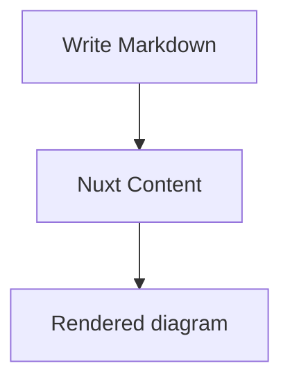
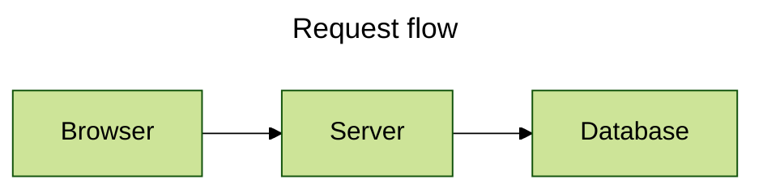
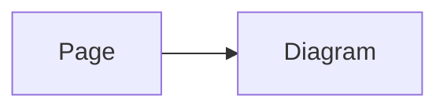
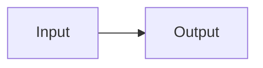

# Writing Diagrams

Create diagrams directly in Markdown when using Nuxt Content, or use the global `<Mermaid>` component in Vue. Both paths use the built-in renderer by default; when the custom renderer named by `components.renderer` resolves successfully, both paths use it instead. Their configuration inputs differ: Markdown can use page configuration or fence frontmatter, while Vue uses component props.

## Mermaid fences

Use `mermaid` as the fenced-code language:

````md

````

Only a valid, non-empty top-level Mermaid fence is transformed. Other Markdown stays unchanged, and an unclosed or invalid metadata block stays as source rather than becoming a partially configured diagram.

## Fence attributes: title, Mermaid configuration, and toolbar

Fence attributes provide a concise way to set a Mermaid diagram title, native Mermaid configuration, and the built-in toolbar. The supported top-level attributes are `title`, `config`, and `toolbar`. Nested `toolbar` properties can use dot notation or a single JSON object.

### Examples

Dot notation:

````md
```mermaid {title="Request flow" config='{"theme":"forest"}' toolbar.title="Flow" toolbar.buttons.copy=false}
flowchart LR
  Browser --> Server --> Database
```
````

JSON string with the equivalent toolbar configuration:

````md
```mermaid {title="Request flow" config='{"theme":"forest"}' toolbar='{"title":"Flow","buttons":{"copy":false}}'}
flowchart LR
  Browser --> Server --> Database
```
````

### Supported attributes

The following top-level attributes are supported by a fence:

- In a Markdown fence, use dot notation for nested settings, such as `toolbar.buttons.copy=false`.
- In YAML frontmatter or a `<Mermaid>` component, use nested objects instead. See [Configuration](/configuration) for option defaults.

| Option | Type | Purpose and limits |
| --- | --- | --- |
| `title` | `string` | Mermaid diagram-title metadata, handled by Mermaid; it is not the toolbar title. |
| `config` | Mermaid configuration object | Native Mermaid configuration, handled by Mermaid. |
| `toolbar` | toolbar configuration object | Built-in renderer toolbar settings; see [Toolbar configuration](/configuration#toolbar) for all fields and defaults. |

::callout{variant="info" title="title and toolbar.title are different"}
`title` is handled by Mermaid, while `toolbar.title` controls the package toolbar.
::

### Use Mermaid YAML frontmatter

For several values, put Mermaid YAML frontmatter at the beginning of the diagram source. Comments and Mermaid directives may appear before it.

````md

````

The YAML `title` and `config` values remain Mermaid-owned, while this module converts `toolbar` into a built-in renderer prop. This YAML is frontmatter inside the Mermaid fence, not the Content frontmatter at the top of the page. For Mermaid's complete YAML-frontmatter schema, use the [Mermaid configuration documentation](https://mermaid.js.org/config/configuration.html).

## Page and diagram configuration

Page Mermaid Config is the pure-data `config` field in a Content page's frontmatter. It is passed to every built-in Mermaid renderer on that page.

::callout{variant="warning" title="Declare config in the collection schema"}
Nuxt Content uses the collection schema to decide which frontmatter fields become top-level page data. Without a declared `config` field, the module cannot receive `pageConfig`, so diagrams on the page do not use that configuration. Declare the field as shown below.
::

```ts
import { defineCollection, defineContentConfig, z } from '@nuxt/content'

export default defineContentConfig({
  collections: {
    content: defineCollection({
      type: 'page',
      source: '**',
      schema: z.object({
        // Declare config as a collection field so Mermaid pageConfig can receive it.
        config: z.record(z.unknown()).optional(),
      }).passthrough(),
    }),
  },
})
```

After declaring the field, set `config` in the page frontmatter:

````md
---
config:
  flowchart:
    curve: basis
---


````

Page Mermaid Config crosses the Content transport, so it must contain strict pure data. Use [Direct Mermaid Config](#the-mermaid-component) when application code needs a client-only Mermaid capability.

### How configuration sources divide responsibilities

See [Configuration sources](/configuration#configuration-sources) for the scope and override rules of module, runtime, page, component, and fence configuration. The remainder of this page covers Mermaid directives inside a fence and diagram-configuration precedence.

### Use Mermaid directives deliberately

Mermaid directives remain part of Mermaid source and are interpreted by Mermaid itself:

````md

````

The package does not parse a directive into its own option model. Refer to Mermaid's [directives documentation](https://mermaid.js.org/config/directives.html) for directive syntax and Mermaid-owned precedence.

## Configuration precedence

There are three separate decisions:

1. Within one Mermaid fence, inline attributes override matching Mermaid YAML frontmatter properties. A diagram-level `toolbar` value also overrides toolbar defaults.
2. The built-in renderer combines Runtime Mermaid Config with exactly one optional source: Page Mermaid Config for Markdown, or Direct Mermaid Config for Vue. They cannot be supplied together as competing props.
3. Mermaid YAML frontmatter and `%%{init: ...}%%` directives remain in the source and are interpreted according to Mermaid's own rules. This package does not redefine Mermaid's configuration schema or directive precedence.

Theme selection is separate: the selected configuration source's `config.theme` wins over manual theme mode, detected color mode, and the base theme. That source is Page Mermaid Config for Markdown or Direct Mermaid Config for Vue. Mermaid YAML frontmatter and directives are still processed by Mermaid when it reads the source. See [Themes and Styling](/advanced/themes-and-styling#understand-theme-resolution) for the package-owned policy.

## The Mermaid component

`<Mermaid>` is globally registered. Pass URI-encoded source through `code` when source comes from application code:

```vue
<script setup lang="ts">
const source = encodeURIComponent(`flowchart TD
  A --> B`)
</script>

<template>
  <Mermaid :code="source" />
</template>
```

For a Direct Mermaid Config, pass `config` directly. Unlike Page Mermaid Config, it may include the Mermaid capabilities accepted in client-side application code:

```vue
<Mermaid :code="source" :config="{ flowchart: { curve: 'basis' } }" />
```

You can also pass component-level toolbar settings directly:

```vue
<Mermaid
  :code="source"
  :config="{ flowchart: { curve: 'basis' } }"
  :toolbar="{ title: 'Flow', buttons: { copy: false } }"
/>
```

`pageConfig` and `config` are mutually exclusive. Supplying both is a `MermaidComponentConfigurationError`; remove one rather than using one as an override for the other. You may also omit `code` and provide a default `<pre><code>` slot, which the built-in renderer uses as source and no-JavaScript fallback.

## Mermaid configuration

`loader.init`, Page Mermaid Config, Direct Mermaid Config, Mermaid YAML frontmatter, and directives can carry Mermaid configuration. This package preserves Mermaid-owned data without redefining its option schema, theme names, security settings, or directive semantics. Consult Mermaid's [configuration documentation](https://mermaid.js.org/config/configuration.html) for that schema.
