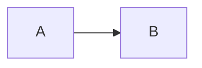

# Troubleshooting

Start from an observable symptom, then reduce the page to one diagram and the smallest relevant configuration. This distinguishes a Content setup problem from a package configuration or Mermaid render problem.

## Installation or Content setup fails

Confirm Node.js `>=22.19.0`, Nuxt `^4.1.0`, and Nuxt Content `>=3.5.0 <4.0.0`. Verify that the Nuxt Content database connector you chose installed successfully.

For pnpm v10+, native connectors can be blocked until you run `pnpm approve-builds` or add the chosen connector to `pnpm.onlyBuiltDependencies`. Resolve that connector failure before investigating this module. The installation choices are detailed in [Getting Started](/getting-started#install-the-application-dependencies).

## Nuxt configuration fails

Check these boundaries first:

- Register `@barzhsieh/nuxt-content-mermaid` in `modules`.
- Use `contentMermaid`, not the removed `mermaidContent` key.
- Keep `contentMermaid.enabled` in build-time Nuxt configuration.
- Keep `runtimeConfig.public.contentMermaid` to strict pure data and do not put `enabled` there.
- Use only documented package-owned keys; unknown package keys are configuration errors.

Module and runtime configuration failures have the public fingerprint `ContentMermaidConfigurationError` with code `CONTENT_MERMAID_CONFIGURATION_ERROR`. Component-source conflicts have `MermaidComponentConfigurationError` with code `CONTENT_MERMAID_COMPONENT_CONFIGURATION_ERROR`. Treat names, codes, and reported paths as the supported diagnostic surface; do not parse internal issue objects or console wording.

Remove all `contentMermaid` options and build with module registration alone. If it succeeds, restore one option group at a time. For v3 boundary changes, consult [Migration to v3](/migration/v3).

## Mermaid source stays visible

Confirm that the fence is non-empty and uses `mermaid`, that the route renders the expected Content page, and that JavaScript is running without a hydration error. Then try this small diagram:

````md

````

If this works, restore the original source incrementally and validate its syntax with Mermaid's documentation. If it does not, check browser console and build output, then verify the page's Content collection retains its `config` field as described in [Writing Diagrams](/writing-diagrams#configure-every-diagram-on-a-page).

Invalid fence-local metadata deliberately stays as source. Check that inline attributes only use `title`, `displayMode`, `config`, and `toolbar`, and that Mermaid YAML frontmatter is valid YAML with matching `---` delimiters.

## A diagram shows a render error

Open the browser console and determine whether the error appears after Mermaid began rendering. A built-in render failure shows the configured `components.error`, an `#error` slot, or the default error view. With `debug: true`, Mermaid uses non-suppressed error rendering and a more useful log level unless you explicitly configured those Mermaid values.

The built-in renderer stages a new render and keeps the previously committed diagram visible if the next attempt fails or becomes stale. Reduce the failing input to a three-node Mermaid example, then add syntax and configuration back in small steps.

## A custom renderer does not appear

`components.renderer` is a candidate, not an immediate replacement. While its application component is resolving, source fallback remains visible. If the candidate is not found or fails to load, the package logs a warning and hands rendering back to the built-in renderer.

Check the configured name against a file under `~/components`, then test without `components.renderer` to establish that the built-in path renders. Once a custom renderer resolves, its own mount and render failures belong to that component; the package does not switch back later. See [Custom Rendering](/advanced/custom-rendering#understand-renderer-selection) for the handoff rules and extension inputs.

## Make a useful reproduction

When opening an issue, include:

1. Package, Nuxt, Nuxt Content, Node.js, and package-manager versions.
2. The smallest Markdown page or Vue component that fails.
3. Relevant `contentMermaid`, runtime, and page configuration (remove secrets).
4. The route, build output, and complete browser/server error text.
5. Whether the built-in renderer succeeds when a custom renderer is removed.

Open an issue at [github.com/andy820621/nuxt-content-mermaid/issues](https://github.com/andy820621/nuxt-content-mermaid/issues) after the reduced reproduction still fails.
