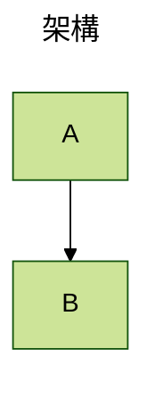
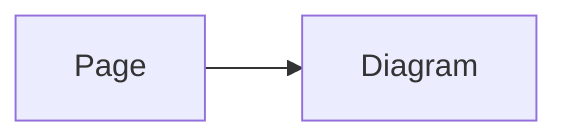

# 撰寫圖表

## Mermaid 圍欄

使用語言標記恰好是 `mermaid` 的圍欄程式碼區塊：

````md

````

Nuxt Content Mermaid 會以 Mermaid 元件取代原始區塊，同時保留可讀的原始碼，作為未啟用 JavaScript 時的後援內容。

## 圍欄標題與顯示模式

將標題或 Mermaid 顯示模式加入圍欄的行內中繼資料：

````md

````

如果圖表需要多個值，也可以在區塊內放置 Mermaid YAML frontmatter：

````md

````

## Mermaid 元件

當圖表來源是 Vue 而不是 Markdown 時，請使用全域註冊的 `<Mermaid>` 元件。將經 URI 編碼的來源傳入 `code`：

```vue
<script setup lang="ts">
const source = encodeURIComponent(`flowchart TD
  A --> B`)
</script>

<template>
  <Mermaid :code="source" />
</template>
```

元件也接受直接傳入的 Mermaid `config` prop。請勿同時提供 `pageConfig` 與 `config`；兩者是同一個圖表的替代設定來源。

## 頁面與圖表設定

使用頁面 frontmatter，將純資料 Mermaid 設定套用至 Markdown 頁面上的所有圖表：

````md
---
config:
  theme: forest
  flowchart:
    curve: basis
---


````

若只要設定單一圖表，請使用行內圍欄中繼資料，或在 Mermaid 圍欄內放置 YAML frontmatter。在應用程式碼中，請改用元件直接提供的 `config` prop，而不是頁面設定。

## 設定優先順序

越接近圖表的設定，優先順序越高：

1. 行內圍欄中繼資料會覆寫圖表的 YAML frontmatter。
2. 圖表設定會覆寫頁面設定。
3. 頁面設定會覆寫 `contentMermaid.loader.init` 的應用程式預設值。

圖表內的 Mermaid 指令由 Mermaid 本身解析，並可依照 Mermaid 的規則覆寫初始化值。

## Mermaid 設定

你可以在頁面 frontmatter 的 `config` 中指定圖表主題等 Mermaid 設定，例如 `config: { theme: forest }`。

如果想了解更多 Mermaid 主題、圖表選項、安全性設定與指令，請參考 [Mermaid 官方設定文件](https://mermaid.js.org/config/configuration.html)。
