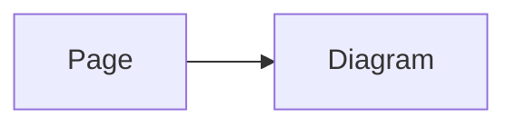

# 升級至 v3

第 3 版需要 Node.js `>=22.19.0`、Nuxt `^4.1.0` 與 Nuxt Content `>=3.5.0 <4.0.0`。請升級這些相依套件、安裝 3.x 套件，然後套用以下設定變更。

## 重新命名模組鍵

`contentMermaid` 是唯一受支援的 Nuxt 設定鍵。請在所有地方替換 v2 相容性別名：

```ts
// v2 相容性別名 — 已移除
export default defineNuxtConfig({
  mermaidContent: { debug: true },
})

// v3
export default defineNuxtConfig({
  contentMermaid: { debug: true },
})
```

## 在建置時維持模組啟用

`contentMermaid.enabled` 決定 Nuxt 是否安裝 Markdown 轉換與執行階段整合。請將它保留在 Nuxt 設定中：

```ts
export default defineNuxtConfig({
  contentMermaid: { enabled: false },
})
```

請勿將 `enabled` 移至 `runtimeConfig.public.contentMermaid`；變更公開執行階段資料，無法在 Nuxt 啟動後啟用或停用模組。

## 執行階段只傳遞純資料

`runtimeConfig.public.contentMermaid` 接受 Nuxt 可以序列化的資料：字串、布林值、`null`、有限數字、一般物件與陣列。請勿在其中放入函式、類別實例、symbol、`undefined`、循環參照或其他僅限用戶端的能力。

```ts
export default defineNuxtConfig({
  runtimeConfig: {
    public: {
      contentMermaid: {
        loader: { init: { flowchart: { curve: 'basis' } } },
      },
    },
  },
})
```

請改為將受支援的僅限用戶端值直接傳給 `<Mermaid :config="...">`。

## 選擇頁面或直接使用 Mermaid 設定

對於以 Content 撰寫的 Markdown，請將純資料 Mermaid 設定放在頁面的 `config` frontmatter 中：

````md
---
config:
  theme: forest
---


````

對於應用程式碼，請將 `config` 直接傳給 Mermaid 元件。元件的 `pageConfig` 與 `config` prop 互為替代；同時提供兩者會造成設定錯誤。

## 注意屬性存在性合併

在 v3 中，不存在的屬性會回退至較低的設定層；除非兩個值都是一般物件，否則存在的值會取代較低層的值。這表示 `false`、`0`、`''`、`null`、空陣列與非空陣列都是刻意的覆寫，而不是要求使用預設值。

請檢查先前依賴 `defu` 式補值的設定，尤其是空值與 falsy 值。

## 將 expand 布林值視為重設

`expand: true` 與 `expand: false` 會將完整的展開狀態重設為相應的套件預設組合。選項物件則會修補個別屬性。

```ts
// 較低層已停用展開。
{ expand: false }

// 這會變更邊距，但不會重新啟用展開。
{ expand: { margin: 32 } }

// 明確重新啟用展開。
{ expand: { enabled: true, margin: 32 } }
```

## 移除 useColorModeTheme

在 v3 中，`theme.useColorModeTheme` 僅為相容性而接受，實際上不會執行任何操作。它不會啟用或停用色彩模式整合，因此請移除此鍵。請設定 `theme.light` 與 `theme.dark`；安裝 `@nuxtjs/color-mode` 後會自動整合。

## 移除套件根目錄的轉換匯入

第 3 版移除了未記錄文件的套件根目錄匯出 `transformMermaidCodeBlocks`。沒有替代的公開轉換 API。請註冊 Nuxt 模組，讓它負責 Markdown 轉換。

## 升級檢查清單

- 將 Node.js、Nuxt 與 Nuxt Content 升級至受支援的版本範圍。
- 安裝 3.x 套件。
- 將 `mermaidContent` 替換為 `contentMermaid`。
- 將 `enabled` 保留在建置時的模組設定中。
- 確保公開執行階段設定只包含可序列化的純資料。
- Markdown 使用頁面設定，Vue 使用直接傳入的 `config`，同一個元件上不可同時使用兩者。
- 在屬性存在性合併下檢查空值與 falsy 覆寫。
- 檢查 `expand` 布林值重設，需要時明確重新啟用展開。
- 移除 `theme.useColorModeTheme`。
- 移除 `transformMermaidCodeBlocks` 的匯入。
- 執行正式環境建置，並重新載入升級後的 Content 路由。
