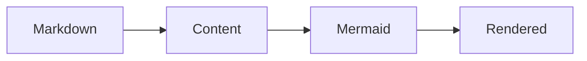

This path describes the exact stable artifact `@barzhsieh/nuxt-content-mermaid@3.0.0`. Complete it in your own working Nuxt Content application—the Contract Demo on this website is evidence, not your success checkpoint.

## Prerequisites

Confirm these boundaries before changing your application:

- Node.js `>=22.19.0`
- Nuxt `^4.1.0`
- Nuxt Content `>=3.5.0 <4.0.0`
- A Nuxt Content database connector supported by your installed Content version

On Node.js, choose a connector such as `better-sqlite3`, `sqlite3`, or supported native SQLite. The connector belongs to your application, not this module. With pnpm 10 and a native connector, approve only the build scripts you selected with `pnpm approve-builds`.

## Install

Install the exact package used by this documentation together with the Package User-owned Nuxt Content peer:

```bash
pnpm add @barzhsieh/nuxt-content-mermaid@3.0.0 @nuxt/content
```

Mermaid is bundled by the module. Do not install Mermaid separately just to satisfy this integration.

## Enable the module

Add the package to `nuxt.config.ts`:

```ts
export default defineNuxtConfig({
  modules: ['@barzhsieh/nuxt-content-mermaid'],
})
```

The module declares its Nuxt Content relationship and initialization order. If your application already lists `@nuxt/content`, you may keep it, but it is not required in the standard module list.

## Add your first diagram

Create or edit a Markdown file under your Content source—for example `content/hello.md`:

````md
# Hello diagram


````

Keep the fence language exactly `mermaid`. Nuxt Content Mermaid transforms that block during the Content build and the browser renders the result after hydration.

## Start and build the application

Start the development server and open the route that renders `content/hello.md`:

```bash
pnpm dev
```

Before deploying, verify the same path through your normal production build:

```bash
pnpm build
```

## First Successful Render

You have reached First Successful Render when the route in **your application** shows an interactive diagram in place of the Mermaid source, reloads without a hydration error, and still builds successfully. Seeing the website Contract Demo does not complete this checkpoint.

## If it does not render

Use the symptom you can observe; each path stops at the smallest likely boundary.

| Symptom | Confirm | Next step |
| --- | --- | --- |
| **Install fails** | Check Node `>=22.19.0`, the Nuxt and Content peer ranges, and whether your chosen database connector installed. | Align the application versions; for pnpm 10 native connectors, run `pnpm approve-builds`, then reinstall. |
| **Build fails** | Confirm the dependency is exactly `@barzhsieh/nuxt-content-mermaid@3.0.0` and the package appears in `modules`. If you added module options, confirm they use the optional `contentMermaid` namespace. | Remove the retired `mermaidContent` namespace, verify the Content connector, then run `pnpm build` again. |
| **Source stays visible** | Confirm the fence says `mermaid`, JavaScript is enabled, and the browser console has no hydration or Mermaid error. | Reload the direct content route; if the source remains, reduce it to the three-node example above. |

If the reduced example still fails on a declared-compatible combination, record the exact package, Nuxt, Nuxt Content, Node, connector, build error, and browser error before opening a GitHub issue. This inline routing is intentionally bounded to reaching the first render.
