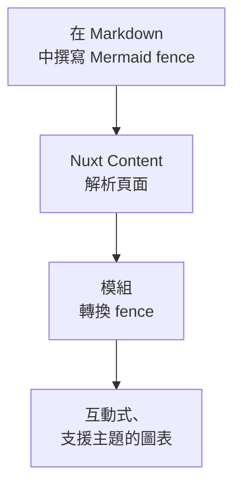

```mermaid
flowchart TD
  Source["在 Markdown<br/>中撰寫 Mermaid fence"]
  Content["Nuxt Content<br/>解析頁面"]
  Module["模組<br/>轉換 fence"]
  Diagram["互動式、<br/>支援主題的圖表"]

  Source --> Content
  Content --> Module
  Module --> Diagram
```
