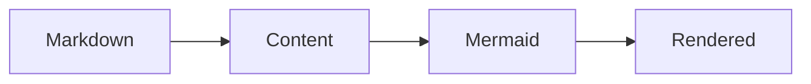

# 開始使用

Nuxt Content Mermaid 是一個依附於 Nuxt Content 的 Nuxt 模組。
使用前須安裝 Nuxt Content；本模組會在 Nuxt 應用程式中宣告並啟動它。

## 事前準備

請確認使用環境與套件：

- Node.js: `>=22.19.0`
- Nuxt: `^4.1.0`
- Nuxt Content: `>=3.5.0 <4.0.0`

## 安裝

請使用習慣的套件管理器安裝本模組，以及它的 Nuxt Content 對等相依套件（peer dependency）。
Mermaid 是 Nuxt Content Mermaid 的相依套件，會自動安裝，不必另外加入。

```bash
# pnpm
pnpm add @barzhsieh/nuxt-content-mermaid @nuxt/content

# npm
npm install @barzhsieh/nuxt-content-mermaid @nuxt/content

# yarn
yarn add @barzhsieh/nuxt-content-mermaid @nuxt/content
```

::callout{variant="warning" title="安裝提示"}
當您在 Node.js 中執行專案時，Nuxt Content 會詢問您要使用的資料庫連接器（database connector）。您可以選擇安裝 `better-sqlite3` 或 `sqlite3` 套件。
如果您不想安裝任何套件，可以使用 Node.js v22.5.0 或更新版本所提供的原生 SQLite。詳細資訊請參閱 [Nuxt Content 安裝指南](https://content.nuxt.com/docs/getting-started/installation#automatic-setup)，確認其支援的連接器。

使用 pnpm v10 以上版本時，原生連接器的建置腳本必須明確核准：

```bash
pnpm approve-builds
```

或是在 `package.json` 中只允許您選擇的連接器（請依需要替換此範例）：

```json
{
  "pnpm": {
    "onlyBuiltDependencies": ["better-sqlite3"]
  }
}
```

::

## 啟用模組

在 `nuxt.config.ts` 的 `modules` 中加入 Nuxt Content Mermaid：

```ts
export default defineNuxtConfig({
  modules: ['@barzhsieh/nuxt-content-mermaid'],
})
```

本模組會透過 Nuxt 的 `moduleDependencies` 宣告與 Nuxt Content 的關係，並以必要順序啟動它。您仍需安裝 `@nuxt/content` 對等相依套件，但不必另外將它列入 `modules`；若應用程式已經列出，則可保留原有設定。

## 新增第一個 Mermaid 圖表

在 Content 來源建立 Markdown 頁面，並加入 `mermaid` 圍欄：

````md
# 第一張圖表


````

Content 建置期間，本模組會將該圍欄轉換成圖表元件。原始碼會保留，作為可閱讀的無 JavaScript 備援內容。

## 執行應用程式

啟動 Nuxt，然後開啟這份 Markdown 頁面的路由：

```bash
pnpm dev
```

## 下一步

- 在[撰寫圖表](/zh/writing-diagrams)加入各圖表的中繼資料。
- 在[設定](/zh/configuration)設定專案預設值。
- 在[主題與樣式](/zh/advanced/themes-and-styling)調整外觀。
- 用[疑難排解](/zh/troubleshooting)診斷失敗原因。
