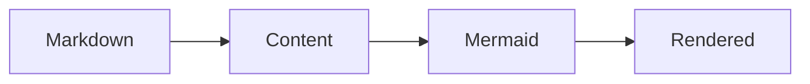

# 開始使用

Nuxt Content Mermaid 是 Nuxt 模組。您的應用程式負責 Nuxt 與 Nuxt Content；本模組負責把 Markdown 整合為 Mermaid 圖表，並管理 Mermaid 相依項目。

## 確認先決條件

請使用 Node.js `>=22.19.0`、Nuxt `^4.1.0` 與 Nuxt Content `>=3.5.0 <4.0.0`。

## 安裝應用程式相依套件

請使用套件管理器安裝本模組與 Nuxt Content 對等相依套件（peer dependency）。Mermaid 由本模組安裝，因此不必為這個整合另外加入 Mermaid。

```bash
# pnpm
pnpm add @barzhsieh/nuxt-content-mermaid @nuxt/content

# npm
npm install @barzhsieh/nuxt-content-mermaid @nuxt/content

# yarn
yarn add @barzhsieh/nuxt-content-mermaid @nuxt/content
```

在 Node 應用程式中，Nuxt Content 可能需要資料庫連接器。`better-sqlite3`、`sqlite3` 與支援版本 Node 的原生 SQLite 都是常見選擇，但選擇權屬於您的應用程式與 Nuxt Content，不屬於本模組。請依已安裝的版本參考 [Nuxt Content 安裝指南](https://content.nuxt.com/docs/getting-started/installation)，確認其支援的連接器。

使用 pnpm v10 以上版本時，原生連接器的建置腳本必須明確核准：

```bash
pnpm approve-builds
```

或是在 `package.json` 中只允許您選擇的連接器（請依需要替換此範例）：

```json
{
  "pnpm": {
    "onlyBuiltDependencies": ["better-sqlite3"]
  }
}
```

## 啟用模組

在 `nuxt.config.ts` 加入 Nuxt Content Mermaid：

```ts
export default defineNuxtConfig({
  modules: ['@barzhsieh/nuxt-content-mermaid'],
})
```

本模組會宣告與 Nuxt Content 的關係，並以必要順序啟動它；但不會安裝、鎖定或更新 Nuxt Content，這些仍是應用程式的責任。若應用程式已在 `modules` 中列出 `@nuxt/content`，保留該項設定仍受支援。

## 渲染第一張圖表

在 Content 來源建立 Markdown 頁面，並加入 `mermaid` 圍欄：

````md
# 第一張圖表


````

Content 建置期間，本模組會將該圍欄轉換成圖表元件。原始碼會保留，作為可閱讀的無 JavaScript 備援內容。

啟動 Nuxt，然後開啟這份 Markdown 頁面的路由：

```bash
pnpm dev
```

## 下一步

- 在[撰寫圖表](/zh/writing-diagrams)加入各圖表的中繼資料。
- 在[設定](/zh/configuration)設定專案預設值。
- 在[主題與樣式](/zh/advanced/themes-and-styling)調整外觀。
- 用[疑難排解](/zh/troubleshooting)診斷失敗原因。
