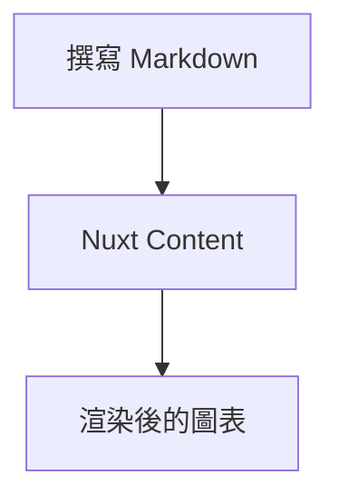
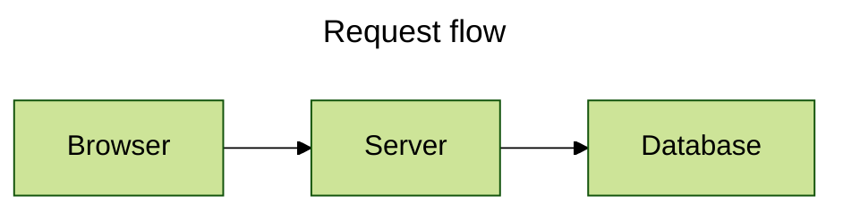
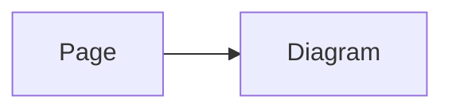
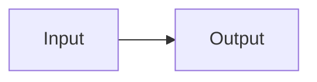

# 撰寫圖表

使用 Nuxt Content 時，可以直接在 Markdown 中建立圖表；在 Vue 中建立圖表時，則使用全域 `<Mermaid>` 元件。
兩種方式預設都使用內建渲染器；成功解析 `components.renderer` 指定的自訂渲染器時，兩者皆改由自訂渲染器處理。圖表設定的傳入方式不同：Markdown 可使用頁面設定或 fence 內 frontmatter，Vue 使用元件 prop。

## Mermaid 圍欄（fence）

請使用 `mermaid` 作為 fenced code block 的語言：

````md

````

只有有效、非空的頂層 Mermaid fence 會被轉換。
其他 Markdown 保持不變；未閉合或中繼資料無效的區塊會保留為原始內容，不會產生只有部分設定的圖表。

## Fence 屬性：標題、Mermaid 設定與工具列

透過 fence 屬性，可用簡潔語法設定 Mermaid 圖表標題、Mermaid 原生設定與內建工具列。
目前支援的頂層屬性是 `title`、`config` 與 `toolbar`。巢狀 `toolbar` 屬性可使用點記法，或以單一 JSON 物件傳入。

### 範例

點記法：

````md
```mermaid {title="Request flow" config='{"theme":"forest"}' toolbar.title="Flow" toolbar.buttons.copy=false}
flowchart LR
  Browser --> Server --> Database
```
````

JSON 字串（等效寫法）：

````md
```mermaid {title="Request flow" config='{"theme":"forest"}' toolbar='{"title":"Flow","buttons":{"copy":false}}'}
flowchart LR
  Browser --> Server --> Database
```
````

### 支援屬性

下表列出 fence 支援的頂層屬性：

- 在 Markdown fence 中，巢狀設定請使用點記法，例如 `toolbar.buttons.copy=false`。
- 在 YAML frontmatter 或 `<Mermaid>` 元件中，則請使用巢狀物件。各選項的預設值請參閱[設定文件](/zh/configuration)。

| 選項 | 類型 | 用途／限制 |
| --- | --- | --- |
| `title` | `string` | Mermaid 圖表標題中繼資料；由 Mermaid 處理，不等同於工具列標題。 |
| `config` | Mermaid 設定物件 | Mermaid 原生設定；由 Mermaid 處理。 |
| `toolbar` | 工具列設定物件 | 內建渲染器的工具列設定；完整欄位與預設值請參閱[工具列設定](/zh/configuration#工具列)。 |

::callout{variant="info" title="title 與 toolbar.title 的差異"}
`title` 與 `toolbar.title` 是不同設定：前者由 Mermaid 處理，後者由本模組控制工具列。
::

### 使用 Mermaid YAML 前置資料

需要設定多個值時，請將 Mermaid YAML 前置資料（frontmatter）放在圖表原始碼開頭。其前可放註解與 Mermaid 指令（directive）。

````md

````

YAML 中的 `title` 與 `config` 仍由 Mermaid 擁有；`toolbar` 則由本模組轉成內建渲染器的 prop。
這裡的 YAML 是 Mermaid fence 內的前置資料，不是頁面最外層的 Content frontmatter。
完整的 Mermaid YAML 前置資料結構描述（schema）請參閱 [Mermaid 設定文件](https://mermaid.js.org/config/configuration.html)。

## 頁面與圖表設定

頁面 Mermaid 設定（Page Mermaid Config）是 Content 頁面前置資料中的純資料 `config` 欄位，會傳給該頁所有內建 Mermaid 渲染器。

::callout{variant="warning" title="collection schema 必須宣告 config"}
Nuxt Content 會依 collection schema 決定哪些 frontmatter 欄位會成為頁面的頂層資料。若未宣告 `config`，它不會成為頁面的頂層欄位，因此本模組無法取得 `pageConfig`，頁面上的 Mermaid 圖表也不會套用這組設定。請務必依下方範例在 schema 中宣告此欄位。
::

```ts
import { defineCollection, defineContentConfig, z } from '@nuxt/content'

export default defineContentConfig({
  collections: {
    content: defineCollection({
      type: 'page',
      source: '**',
      schema: z.object({
        // 請將 config 宣告為 collection 欄位，否則它不會成為頁面的頂層資料，Mermaid pageConfig 無法取得
        config: z.record(z.unknown()).optional(),
      }).passthrough(),
    }),
  },
})
```

宣告完成後，即可在頁面 frontmatter 中設定 `config`：

````md
---
config:
  flowchart:
    curve: basis
---


````

Page Mermaid Config 會穿越 Content 傳輸邊界（transport），因此只能包含嚴格的純資料。若應用程式程式碼需要僅限用戶端的 Mermaid 能力（capability），請使用[直接 Mermaid 設定](#mermaid-元件)。

### 設定來源如何分工

模組、runtime、頁面、元件與 fence 設定的作用範圍及覆寫規則，請參閱[設定來源](/zh/configuration#設定來源)。本頁以下只說明 fence 內的 Mermaid 指令與圖表設定優先順序。

### 審慎使用 Mermaid 指令

Mermaid 指令（directive）仍是 Mermaid 原始碼的一部分，由 Mermaid 自行解讀：

````md

````

本模組不會將指令解析為自己的選項模型。指令語法與 Mermaid 擁有的優先順序，請參閱 Mermaid 的 [指令文件](https://mermaid.js.org/config/directives.html)。

## 設定優先順序

這裡有三個獨立決定：

1. 對同一個 Mermaid fence，行內屬性會覆寫同一 fence YAML 前置資料中的相同屬性；`toolbar` 也會以單一圖表的設定覆寫工具列預設。
2. 內建渲染器會將執行階段 Mermaid 設定（Runtime Mermaid Config）與剛好一個選用來源結合：Markdown 使用 Page Mermaid Config，Vue 使用直接 Mermaid 設定（Direct Mermaid Config）。它們不是可以同時傳入的兩個 prop。
3. Fence 內的 Mermaid YAML 前置資料與 `%%{init: ...}%%` 指令會保留在原始碼中，最後交由 Mermaid 依自己的規則解析。本模組不重新定義 Mermaid 的設定結構或指令優先順序。

主題選擇是另一件事：所選設定來源的 `config.theme` 優先於手動主題模式、偵測到的色彩模式與基礎主題。Markdown 的來源是 Page Mermaid Config，Vue 的來源是 Direct Mermaid Config。Mermaid YAML 前置資料與指令仍在 Mermaid 讀取原始碼時處理。請參閱[主題與樣式](/zh/advanced/themes-and-styling#了解主題解析規則)了解套件擁有的規則。

## Mermaid 元件

`<Mermaid>` 是全域註冊元件。當原始碼來自應用程式程式碼時，請透過 `code` 傳遞 URI 編碼的原始碼：

```vue
<script setup lang="ts">
const source = encodeURIComponent(`flowchart TD
  A --> B`)
</script>

<template>
  <Mermaid :code="source" />
</template>
```

Direct Mermaid Config 請直接傳入 `config`。它不像 Page Mermaid Config，可包含僅限用戶端應用程式程式碼接受的 Mermaid capability：

```vue
<Mermaid :code="source" :config="{ flowchart: { curve: 'basis' } }" />
```

也可以直接傳入元件層級的工具列設定：

```vue
<Mermaid
  :code="source"
  :config="{ flowchart: { curve: 'basis' } }"
  :toolbar="{ title: 'Flow', buttons: { copy: false } }"
/>
```

`pageConfig` 與 `config` 互斥。同時提供兩者會造成 `MermaidComponentConfigurationError`；請移除其中一項，而不是將其中一項當成另一項的覆寫。您也可以省略 `code`，並提供預設 `<pre><code>` 插槽（slot），內建渲染器會將它作為原始碼與無 JavaScript 備援內容。

## Mermaid 設定

`loader.init`、Page Mermaid Config、Direct Mermaid Config、Mermaid YAML 前置資料與指令都可攜帶 Mermaid 設定。本模組會保留 Mermaid 擁有的資料，但不會重新定義其選項結構描述、主題名稱、安全性設定或指令語意。該結構描述請參閱 [Mermaid 設定文件](https://mermaid.js.org/config/configuration.html)。
