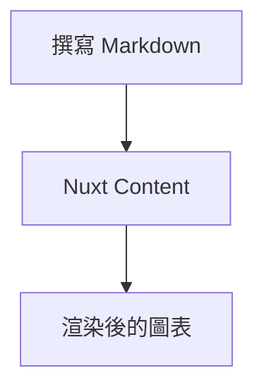
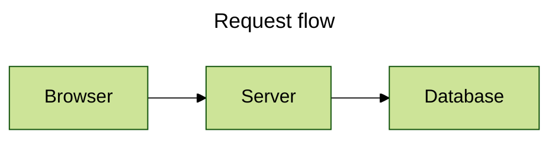
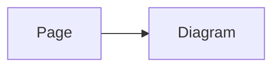
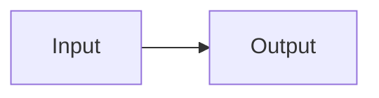

# 撰寫圖表

Content 撰寫的圖表請使用 Markdown；在 Vue 中建立圖表則使用全域 `<Mermaid>` 元件。這兩條路徑刻意採用不同的設定來源。

## 從 Mermaid 圍欄開始

請使用 `mermaid` 作為程式碼圍欄（fenced code block）的語言：

````md

````

只有有效、非空的頂層 Mermaid 圍欄會被轉換。其他 Markdown 保持不變；未閉合或中繼資料無效的區塊會保留為原始碼，不會產生只有部分設定的圖表。

## 加入行內屬性（inline attributes）

圍欄屬性適合簡潔設定標題、顯示模式、Mermaid 設定或工具列選項。支援的頂層屬性為 `title`、`displayMode`、`config` 與 `toolbar`；巢狀鍵使用點記法。

````md
```mermaid {title="Request flow" displayMode=compact config='{"theme":"forest"}' toolbar.title="Flow" toolbar.buttons.copy=false}
flowchart LR
  Browser --> Server --> Database
```
````

`config` 是 Mermaid 擁有的資料。`toolbar` 由本模組擁有，可接受 `title`、`fontSize`、`fullscreenToolbarScale`，以及 `buttons.copy`、`buttons.fullscreen`、`buttons.expand`。

## 使用 Mermaid YAML 前置資料

需要設定多個值時，請將 Mermaid YAML 前置資料（frontmatter）放在圖表原始碼開頭。其前可放註解與 Mermaid 指令（directive）。

````md

````

YAML 的 `config` 資料負載（payload）仍由 Mermaid 擁有；選用的 `toolbar` 資料負載則由本模組處理。完整的 Mermaid YAML 前置資料結構描述（schema）請參閱 [Mermaid 設定文件](https://mermaid.js.org/config/configuration.html)。

## 設定頁面上的所有圖表

頁面 Mermaid 設定（Page Mermaid Config）是 Content 頁面前置資料中的純資料 `config` 欄位，會傳給該頁所有內建 Mermaid 渲染器。請在集合結構描述（collection schema）宣告此欄位，讓 Nuxt Content 保留它：

```ts
import { defineCollection, defineContentConfig, z } from '@nuxt/content'

export default defineContentConfig({
  collections: {
    content: defineCollection({
      type: 'page',
      source: '**',
      schema: z.object({
        config: z.record(z.unknown()).optional(),
      }).passthrough(),
    }),
  },
})
```

````md
---
config:
  flowchart:
    curve: basis
---


````

Page Mermaid Config 會穿越 Content 傳輸邊界（transport），因此只能包含嚴格的純資料。若應用程式程式碼需要僅限用戶端的 Mermaid 能力（capability），請使用[直接 Mermaid 設定](#在-vue-中使用元件)。

## 審慎使用 Mermaid 指令

Mermaid 指令（directive）仍是 Mermaid 原始碼的一部分，由 Mermaid 自行解讀：

````md

````

本模組不會將指令解析為自己的選項模型。指令語法與 Mermaid 擁有的優先順序，請參閱 Mermaid 的 [指令文件](https://mermaid.js.org/config/directives.html)。

## 了解哪個設定會生效

這裡有兩個獨立決定：

1. 在圍欄中繼資料內，行內屬性會逐一覆寫 Mermaid YAML 前置資料的屬性；其 `toolbar` 值也會優先套用至外層元件（wrapper）。
2. 內建渲染器會將執行階段 Mermaid 設定（Runtime Mermaid Config）與剛好一個選用來源結合：Markdown 使用 Page Mermaid Config，Vue 使用直接 Mermaid 設定（Direct Mermaid Config）。它們不是競爭的設定層。

主題選擇是另一件事：所選設定來源的 `config.theme` 優先於手動主題模式、偵測到的色彩模式與基礎主題。Markdown 的來源是 Page Mermaid Config，Vue 的來源是 Direct Mermaid Config。Mermaid YAML 前置資料與指令仍在 Mermaid 讀取原始碼時處理。請參閱[主題與樣式](/zh/advanced/themes-and-styling#了解主題解析規則)了解套件擁有的規則。

## 在 Vue 中使用元件

`<Mermaid>` 是全域註冊元件。當原始碼來自應用程式程式碼時，請透過 `code` 傳遞 URI 編碼的原始碼：

```vue
<script setup lang="ts">
const source = encodeURIComponent(`flowchart TD
  A --> B`)
</script>

<template>
  <Mermaid :code="source" />
</template>
```

Direct Mermaid Config 請直接傳入 `config`。它不像 Page Mermaid Config，可包含僅限用戶端應用程式程式碼接受的 Mermaid capability：

```vue
<Mermaid :code="source" :config="{ flowchart: { curve: 'basis' } }" />
```

`pageConfig` 與 `config` 互斥。同時提供兩者會造成 `MermaidComponentConfigurationError`；請移除其中一項，而不是將其中一項當成另一項的覆寫。您也可以省略 `code`，並提供預設 `<pre><code>` 插槽（slot），內建渲染器會將它作為原始碼與無 JavaScript 備援內容。
