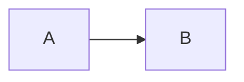

# 疑難排解

請從可觀察的症狀開始，接著將頁面縮減成一張圖表與最小的相關設定。這能區分 Content 設定問題、套件設定問題與 Mermaid 渲染問題。

## 安裝或 Content 設定失敗

請確認 Node.js `>=22.19.0`、Nuxt `^4.1.0` 與 Nuxt Content `>=3.5.0 <4.0.0`，並確認您選擇的 Nuxt Content 資料庫連接器已順利安裝。

pnpm v10 以上版本可能會封鎖原生連接器，直到您執行 `pnpm approve-builds` 或將所選連接器加入 `pnpm.onlyBuiltDependencies`。請先排除連接器失敗，再檢查本模組。安裝選擇詳見[開始使用](/zh/getting-started#安裝應用程式相依套件)。

## Nuxt 設定失敗

先確認以下邊界：

- 在 `modules` 註冊 `@barzhsieh/nuxt-content-mermaid`。
- 使用 `contentMermaid`，而非已移除的 `mermaidContent` 鍵。
- 將 `contentMermaid.enabled` 保留在建置期 Nuxt 設定中。
- `runtimeConfig.public.contentMermaid` 只能使用嚴格純資料，且不能在其中放入 `enabled`。
- 只使用文件列出的套件擁有鍵；未知套件鍵會造成設定錯誤。

模組與執行階段設定失敗的公開辨識特徵（fingerprint）是 `ContentMermaidConfigurationError`，代碼為 `CONTENT_MERMAID_CONFIGURATION_ERROR`。元件設定來源衝突則是 `MermaidComponentConfigurationError`，代碼為 `CONTENT_MERMAID_COMPONENT_CONFIGURATION_ERROR`。請將名稱、代碼與回報路徑視為支援的診斷介面；不要解析內部問題物件或主控台訊息措辭。

移除所有 `contentMermaid` 選項，只保留模組註冊後再建置。若成功，請逐組還原選項。v3 的邊界變更請參閱[遷移至 v3](/zh/migration/v3)。

## Mermaid 原始碼仍然可見

請確認圍欄非空且使用 `mermaid`、該路由渲染了預期的 Content 頁面，並且 JavaScript 正常執行、沒有水合錯誤（hydration error）。接著測試此簡短圖表：

````md

````

若這可運作，請逐步還原原始碼，並用 Mermaid 文件驗證語法。若無法運作，請檢查瀏覽器主控台與建置輸出，然後確認頁面的 Content 集合會保留 `config` 欄位，如[撰寫圖表](/zh/writing-diagrams#設定頁面上的所有圖表)所述。

無效的圍欄本地中繼資料會刻意保留為原始碼。請確認行內屬性只使用 `title`、`displayMode`、`config` 與 `toolbar`，且 Mermaid YAML 前置資料是含有成對 `---` 分隔符號的有效 YAML。

## 圖表顯示渲染錯誤

開啟瀏覽器主控台，確認錯誤是否在 Mermaid 開始渲染後出現。內建渲染失敗會顯示已設定的 `components.error`、`#error` 插槽或預設錯誤檢視。使用 `debug: true` 時，除非您明確設定了這些 Mermaid 值，否則 Mermaid 會採用未抑制的錯誤渲染與更實用的記錄層級。

內建渲染器會暫存新的渲染作業，若下一次嘗試失敗或過期，仍保留先前已提交的圖表可見。請將失敗輸入縮減為三節點 Mermaid 範例，再逐步加入語法與設定。

## 自訂渲染器沒有顯示

`components.renderer` 是候選項，不會立即取代內建渲染器。應用程式元件解析期間，原始碼備援內容會保持可見。找不到候選項或其載入失敗時，套件會記錄警告，並將渲染交回內建渲染器。

請對照設定名稱與 `~/components` 下的檔案，接著移除 `components.renderer` 進行測試，先確定內建路徑能渲染。自訂渲染器一旦解析成功，後續的掛載或渲染失敗都屬於該元件；套件不會再切換回內建渲染器。交接規則與擴充輸入請參閱[自訂渲染](/zh/advanced/custom-rendering#了解渲染器選擇)。

## 建立有用的重現案例

開啟問題回報時，請提供：

1. 套件、Nuxt、Nuxt Content、Node.js 與套件管理器版本。
2. 失敗的最小 Markdown 頁面或 Vue 元件。
3. 相關的 `contentMermaid`、執行階段與頁面設定（請移除機密資料）。
4. 路由、建置輸出，以及完整的瀏覽器／伺服器錯誤文字。
5. 移除自訂渲染器後，內建渲染器是否正常。

縮減後的重現案例仍失敗時，請到 [github.com/andy820621/nuxt-content-mermaid/issues](https://github.com/andy820621/nuxt-content-mermaid/issues) 開啟問題回報。
